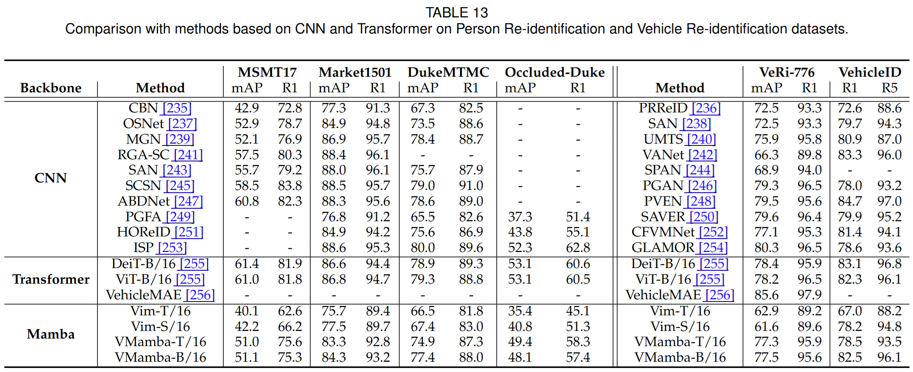

## Code for State Space Model for New-Generation Network Alternative to Transformers: A Survey

The repository is the implementation of the 'Person/Vehicle Re-Identification' subsection in our [paper](https://arxiv.org/pdf/2404.09516).

[](https://arxiv.org/pdf/2404.09516)
[](#training-the-code)
[](#citation)

### Training the Code

1. First, please build the conda environment based on [VMamba](https://github.com/MzeroMiko/VMamba) or [ViM](https://github.com/hustvl/Vim).
2. Prepare the `.pth` modal file in this `./pretrained` path.
3. Use `ln -s 'path_for_dataset' dataset_name` to build soft link for each dataset in the `./data` directory.
2. After that, running code like,
```
python train_vmamba.py --config_file configs/DukeMTMC/vmamba_base.yml
```
5. Refer to the configuration in `configs/DukeMTMC/vmamba_base.yml` to conduct a new experiment.

## Performance


## Acknowledgements

Our code builds upon the [TransReID](https://github.com/damo-cv/TransReID), [VMamba](https://github.com/MzeroMiko/VMamba), and [ViM](https://github.com/hustvl/Vim). Thanks for their nice work. More news will released at [Event-AHU](https://github.com/Event-AHU), [MM-ReID](https://aihuazheng.github.io/), and [Our Works](https://github.com/lsh-ahu).

## Citation
If you like our work, please consider citing:
```bibtex
@article{wang2024state,
  title={State space model for new-generation network alternative to transformers: A survey},
  author={Wang, Xiao and Wang, Shiao and Ding, Yuhe and Li, Yuehang and Wu, Wentao and Rong, Yao and Kong, Weizhe and Huang, Ju and Li, Shihao and Yang, Haoxiang and others},
  journal={arXiv preprint arXiv:2404.09516},
  year={2024}
}
```
